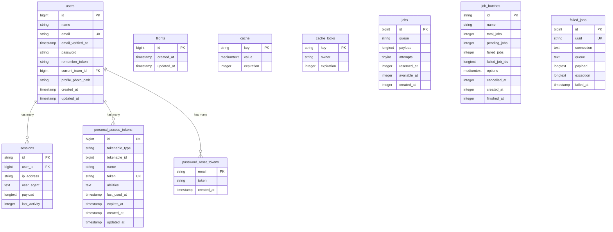

# Diagrama de Modelado de Datos - Laravel

## Descripción de las Tablas

### Tablas Principales
- **users**: Gestión de usuarios con autenticación y perfiles
- **flights**: Tabla de ejemplo (actualmente vacía)

### Tablas de Autenticación y Seguridad
- **password_reset_tokens**: Tokens para reseteo de contraseñas
- **sessions**: Sesiones de usuario activas
- **personal_access_tokens**: Tokens de API personal (Laravel Sanctum)

### Tablas del Sistema
- **cache/cache_locks**: Sistema de caché de Laravel
- **jobs/job_batches/failed_jobs**: Sistema de colas de trabajo

### Relaciones Identificadas
- Un usuario puede tener múltiples sesiones activas
- Un usuario puede tener múltiples tokens de acceso personal
- Un usuario puede tener múltiples tokens de reseteo de contraseña